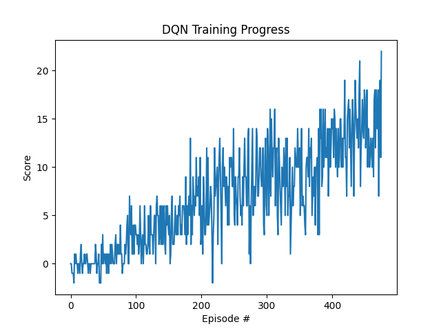

# Report

## Learning Algorithm

The agent uses a **Deep Q-Network (DQN)** algorithm to learn an optimal policy for navigating the Banana environment. DQN extends traditional Q-Learning by using a deep neural network to approximate the action-value function Q(s,a).

### Key DQN Features:

- **Experience Replay**: Experiences (state, action, reward, next_state, done) are stored in a replay buffer and sampled randomly during training. This breaks correlations between consecutive experiences and improves learning stability.
- **Fixed Q-Targets**: A separate target network is used to compute TD targets, updated slowly via soft updates. This prevents the moving target problem where the network chases its own predictions.
- **Epsilon-Greedy Exploration**: The agent balances exploration and exploitation using an epsilon-greedy policy that decays over time.

### Neural Network Architecture

The Q-Network (`model.py`) consists of:

| Layer | Input | Output | Activation |
|-------|-------|--------|------------|
| fc1 | 37 (state_size) | 64 | ReLU |
| fc2 | 64 | 64 | ReLU |
| fc3 | 64 | 4 (action_size) | None |

The network takes a state vector of 37 dimensions and outputs Q-values for each of the 4 possible actions.

### Hyperparameters

| Parameter | Value | Description |
|-----------|-------|-------------|
| BUFFER_SIZE | 100,000 | Replay buffer capacity |
| BATCH_SIZE | 64 | Mini-batch size for learning |
| GAMMA | 0.99 | Discount factor |
| TAU | 1e-3 | Soft update interpolation parameter |
| LR | 5e-4 | Learning rate (Adam optimizer) |
| UPDATE_EVERY | 4 | Steps between learning updates |
| n_episodes | 2000 | Maximum training episodes |
| max_t | 1000 | Maximum timesteps per episode |
| eps_start | 1.0 | Starting epsilon (exploration) |
| eps_end | 0.01 | Minimum epsilon |
| eps_decay | 0.995 | Epsilon decay rate per episode |

## Training Results

### Environment Details

The Unity "Banana" environment was initialized with the following configuration:

- **Brain**: BananaBrain
- **State space**: Continuous, 37 dimensions (per agent), 1 stacked observation
- **Action space**: Discrete, 4 actions

### Training Progress

| Milestone | Average Score |
|-----------|--------------|
| Episode 100 | 0.76 |
| Episode 200 | 4.22 |
| Episode 300 | 7.60 |
| Episode 400 | 9.57 |
| **Episode 476** | **13.09** |

**The environment was solved in 376 episodes**, achieving an average score of **13.09** over 100 consecutive episodes (surpassing the +13 threshold).

The agent showed steady improvement throughout training, progressing from near-random behavior (score ~0.76 at episode 100) to competent navigation (score ~9.57 at episode 400), and reaching the solution threshold by episode 476.

## Plot of Rewards

## Ideas for Future Work

Several improvements could enhance the agent's performance:

1. **Double DQN**: Addresses the overestimation bias in standard DQN by decoupling action selection from action evaluation. The local network selects the best action, while the target network evaluates it.

2. **Prioritized Experience Replay**: Instead of sampling uniformly from the replay buffer, prioritize experiences with larger TD errors. This allows the agent to learn more efficiently from surprising or informative experiences.

3. **Dueling DQN**: Separates the Q-network into two streams — one estimating the state value V(s) and another estimating the advantage A(s,a). This helps the agent learn which states are valuable without having to learn the effect of each action in each state.

4. **Rainbow DQN**: Combines multiple DQN improvements (Double DQN, Prioritized Replay, Dueling Networks, Multi-step Learning, Distributional RL, Noisy Nets) into a single agent that often outperforms each individual improvement.

5. **Learning from Pixels**: Train the agent directly from raw pixel observations instead of the 37-dimensional state vector. This would require convolutional neural network layers to process visual input but would be more generalizable.

6. **Hyperparameter Tuning**: Systematic search over hyperparameters (learning rate, network size, epsilon schedule, buffer size) could yield faster convergence and higher scores.
